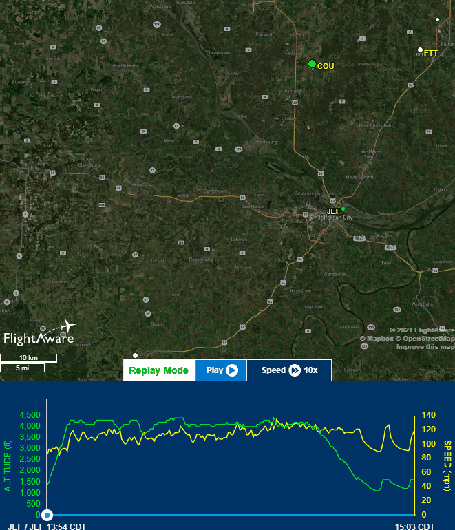

# Information
- Date: 2021-06-03
- Time: 13:00
- Expense: $321.60
	- Ground Instruction: $0.00
		- Rate: $56.00
		- Time: 0.0
	- Flight Instruction: $100.80
		- Rate: $56.00
		- Time: 1.6
	- Plane Rental: $220.80
		- Rate: $138.00
		- Time: 1.6
- Aircraft:
	- Category: Airplane
	- Classification: Single Engine Land
	- Make: Piper
	- Model: Cherokee Warrior II
	- Serial: 28-8316074
	- Identification: N43060
	- Hobbs: 
		- In: 2138.80
		- Out: 2140.40
	- Tach: 
		- In: 4988.80
		- Out: 4990.20
- Points of Departure and Arrival:
	- From: KJEF
	- To: KJEF
- Weather:
	- [Official](http://aviationwxchartsarchive.com/product/metar):
		- METAR: 
			```
			KJEF 031753Z 30006KT 10SM FEW050 27/12 A2998 RMK AO2 SLP139 T02720117 10272 20178 58005
			KJEF 031853Z 29005KT 10SM CLR 28/12 A2997 RMK AO2 SLP134 T02780117
			```
	- [Observed](https://www.wunderground.com/history/daily/us/mo/columbia/KJEF/):
		- Wind: 5kts variable
		- Clouds: Partly cloudy at 5000'
		- Precipitation: 0.0
		- Temperature: 81
		- Humidity: 42
		- Dew Point: 54
		- Pressure: 29.98
		- Visibility: 10sm
- Covered:
	- Climbs
	- Descents
	- Turns
	- Holding Compass Headings and elevation in turns
	- Traffic Pattern
	- Landing
# Lesson Review
**FINALLY AIRBORNE!**

Man, that felt good.  Due to scheduling conflicts and the weather (the real villain here), it had been almost two months (2021-04-13) since my last flight. As I suspected would be the case, that made this a review lesson - but I'm going to have to say that I'm pretty happy with the way it worked out.

## Preflight
No issues to report here.  I was able to use my newly built FOreFlight checklist, which really seemed to help me keep track of where I was easier.

## Taxi
My taxiing game was strong today.  I was able to hold the lines well, maintain a "brisk walk" pace and place the plane with confidence. I noticed that when I stopped at the hold short, I must have been applying uneven pressure to the pedals, because at the last second, the plane turned to the left a bit.

## Takeoff
I felt like I was more authoritative with the throttle (which was something I was "babying" a bit) and I felt like I kept the centerline pretty well.  The climb and turn-out was uneventful (which seems like a great thing in aviation). My climb attitude was a bit extreme, so I'll need to work on that a bit.

## Manuevers
As this was a review lesson, we didn't focus on any particular thing - we just flew the plane. That being said, I was able to hold my altitude and heading really well today - and I made a point of looking outside the plane for directional reference and not focusing on the instruments.

My CFI had me pull a few standard rate turns and navigate to specific headings - which I had done before. That gave me the opportunity to "play" with the plane a bit - fiddling the controls here and there, learning how the plane reacted to various inputs.

## Landing
On the first touch-and-go, my CFI had me follow through with him while he controlled everything so I could feel everything. For the the second and third, I controlled the directionality of plane in the pattern while he manned the throttle and flaps.

# Last Thoughts
Everything about the lesson today felt stronger - and that made me feel great. After quite a bit of frustration (again - the weather hates me), it was awesome to get back into the air.  For my next lesson, I'm hoping to practice a few stalls, an emergency landing and actually shoot a landing.

# Recap Data
- [FlightAware Tracking](https://flightaware.com/live/flight/N43060/history/20210603/1854Z/KJEF/KJEF)
- [FlightAware Tracking Log](./supportData/2021-06-03.flightAwareData.log)
- [FlightAware Tracking KML](./supportData/2021-06-03.flightAware.kml)
- [ForeFlight Log Entry](https://plan.foreflight.com/summary/8774e5ceba06457badfab01d0126a7d2)
- [ForeFLight Track Log](https://plan.foreflight.com/s/track/280291F8-E9C2-42AE-9A3C-644049E519E6)
- [ForeFlight Track Log CSV](./supportData/2021-06-03.foreflight.tracklog.csv)
- [ForeFlight Track Log KML](./supportData/2021-06-03.foreflight.tracklog.kml)
- [ForeFlight Track Log GPX](./supportData/2021-06-03.foreflight.tracklog.kml)

