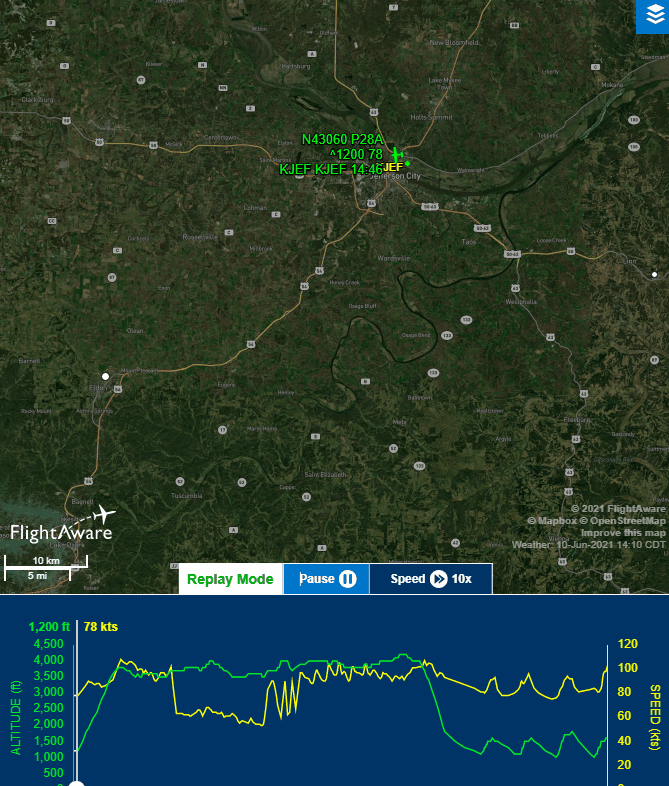

# Information
- Date: 2021-06-10
- Time: 13:00
- Expense: .00
	- Ground Instruction: .00
		- Rate: .00
		- Time: 0.0
	- Flight Instruction: .00
		- Rate: .00
		- Time: 0.0
	- Plane Rental: $207.00
		- Rate: $138.00
		- Time: 1.5
	- Tax: .00
- Aircraft:
	- Category: Airplane
	- Classification: Single Engine Land
	- Make: Piper
	- Model: Cherokee Warrior II
	- Serial: 28-8316074
	- Identification: N43060
	- Hobbs: 
		- Out: 2165.4
		- In: 2166.9
	- Tach: 
		- Out: 5010.9
		- In: 5012.1
- Points of Departure and Arrival:
	- From: KJEF
	- To: KJEF
- Weather:
	- [Official](http://aviationwxchartsarchive.com/product/metar):
		- METAR: 
			```
			KJEF 101853Z 02006KT 10SM FEW048 FEW065 32/19 A2991 RMK AO2 SLP114 T03220189
			KJEF 101953Z 05005KT 10SM FEW050 SCT090 33/18 A2989 RMK AO2 SLP107 T03330183
			KJEF 102053Z 03007KT 10SM FEW050 34/18 A2988 RMK AO2 SLP101 T03390178 58016
			```
	- [Observed](https://www.wunderground.com/history/daily/us/mo/columbia/KJEF/):
		- Wind: 6kt from 20
		- Clouds: Few at 5000'
		- Precipitation: 0.0
		- Temperature: 90
		- Humidity: 45
		- Dew Point: 66
		- Pressure: 29.92
		- Visibility: 10sm
- Covered:
	- Stalls
	- Slow Flight
	- Traffic Pattern
	- Landings
	- Steep Turns
# Lesson Review
## Preflight
The preflight was pretty standard today. I did notice that the fuel was below tabs during my inspection, so I summoned a lineman who was kind enough to walk me through the process, explaining as he went.
## Takeoff
My side of the radio was functional today, so I was actually able to make the calls to Ground and Tower.  The initial calls went fine, but my memory is bad enough that I struggled a bit with the read-backs.  I think I need to get a notepad (to be replaced with an iPad at some point) to keep handy for this kind of thing.

The wind was calm at the time of takeoff, so Ground asked which runway I preferred, so I chose Runway 12, since it would give me more taxi practice. We taxied along to the run-up area of Runway 12 and ran thought the run-up checklist:  No issues to report.

We proceeded to the Runway Hold line and I requested clearance for takeoff.  Off we went!
## Manuevers
### Slow flight
We got up to about 3500' and set up for slow flight.

Once the plane was settled in, my CFI pointed out that left turns were going to require less input and I pretty quickly found that I agreed!  I was meant to turn 180 degrees, but without any thought, I ended up blowing right through 180 and did a complete 360.  I have no idea why I did that - maybe my brain just decided that I needed the practice?  I met the minimums for PPL certification, so I was decently pleased with it.
### Stalls
Since we were pretty well configured for a power off stall, we decided to transition right into them. My memory is pretty bad, so I struggled through the setup steps for both of these - which was frustrating.  I know I'll get it in time.
## Landing
We spent a bit of time in the pattern today, going through the motions:
- Climbing the upwind at 80kts
- Turning crosswind at 45 degrees
- Leveling the wings while continuing the ascent
- Turning downwind at 45 degrees
- Leveling wings
- Building airspeed
- Decreasing power to 1700RPM
- Pitch to glide angle
- Wait for VFE
- Extend 10 degrees of flaps
- Turn base at 45 degrees
- Extend 25 degrees of flaps
- Turn to final
- Extend 45 degrees of flaps
- Confirm glide slope
- Adjust power accordingly
- Begin flare
- Slowly decrease power to idle
- Touch down

We immediately retracted flaps, increased power to full, then set off again - about 9 times.
# Last Thoughts
I'm really enjoying the pattern work!  Hopefully the next lesson will include some more ground reference manuevers, as I need to get up to speed on those quickly.

# Recap Data
- [FlightAware Tracking](https://flightaware.com/live/flight/N43060/history/20210610/1838Z/KJEF/KJEF)
- [FlightAware Tracking Log](./supportData/2021-06-10.flightAwareData.log)
- [FlightAware Tracking KML](./supportData/2021-06-10.flightAware.kml)
- [ForeFlight Log Entry](https://plan.foreflight.com/summary/78fba4cc4b414cf7ae6274fcbf4905ac)
- [ForeFLight Track Log](https://plan.foreflight.com/s/track/B995D1B1-30E0-410A-8C66-621914ED6B24)
- [ForeFlight Track Log CSV](./supportData/2021-06-10.foreflight.tracklog.csv)
- [ForeFlight Track Log KML](./supportData/2021-06-10.foreflight.tracklog.kml)
- [ForeFlight Track Log GPX](./supportData/2021-06-10.foreflight.tracklog.gpx)

