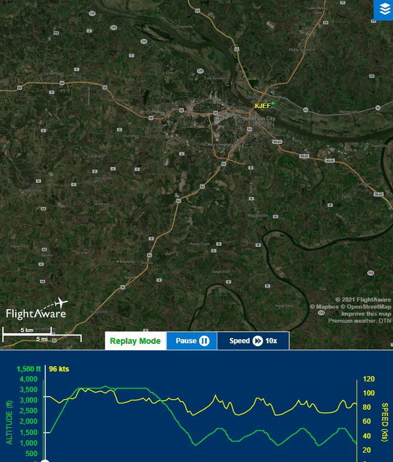

# Information
- Date: 2021-06-11
- Time: 16:30
- Expense: .00
	- Ground Instruction: .00
		- Rate: .00
		- Time: 0.0
	- Flight Instruction: .00
		- Rate: .00
		- Time: 0.0
	- Plane Rental: $138.00
		- Rate: $138.00
		- Time: 1.0
	- Tax: .00
- Aircraft:
	- Category: Airplane
	- Classification: Single Engine Land
	- Make: Piper
	- Model: Cherokee Warrior II
	- Serial: 28-8316074
	- Identification: N43060
	- Hobbs: 
		- Out: 2172.4
		- In: 2173.4
	- Tach: 
		- Out: 5016.7
		- In: 5017.5
- Points of Departure and Arrival:
	- From: KJEF
	- To: KJEF
- Weather:
	- [Official](http://aviationwxchartsarchive.com/product/metar):
		- METAR: 
			```
			KJEF 112053Z VRB06KT 10SM SCT055 35/19 A2985 RMK AO2 SLP092 T03500189 53001
			KJEF 112153Z 06003KT 10SM CLR 34/18 A2985 RMK AO2 SLP092 T03440183
			```
	- [Observed](https://www.wunderground.com/history/daily/us/mo/columbia/KJEF/):
		- Wind: Variable at 6KT
		- Clouds: Scattered at 5500'
		- Precipitation: 0.0
		- Temperature: 95
		- Humidity: 38
		- Dew Point: 66
		- Pressure: 29.26
		- Visibility: 10sm
- Covered:
	- Steep Turns
	- Landings
# Lesson Review
## Preflight
Not much to report here - the preflight was uneventful - which, for a preflight is a great thing.  The various lights, gauges and switches did what they were supposed to do and all of the things that were supposed to be attached to the plane were present and securely affixed.
## Takeoff
After requesting taxi and takeoff clearance from Ground and Tower respectively, we aimed down Runway 12, applied full power, waited for rotation speed and up we went!  We climbed to 500' AGL, turned toward the south west, then continued our climb to 4000'.
## Manuevers
### Steep Turns
Once we reached our target altitude, I reduced power to cruise setting (2300-ish) and trimmed up for around 95kts.  It was right about this time that my CFI pointed out what looked like rain headed our direction.

> Note: I knew the rain was coming - and I even made a point to mention it to my CFI before even heading to the airport - but he thought we could get some time in at least.  He has to get paid and I have to get certified (eventually) - so the call was made to go forward with the lesson.

This is where the single manuever came in - a steep right turn from our current heading of 230 to about 50 - back toward home.  I wasn't thrilled with my rollout (I over shot by about 6 degrees), but I did maintain my altitude throughout the 45 degree bank.
## Landing
Once we got within 8 miles of the airport, my CFI explained some Pilot Math (extremely simple), which told us that we should start descending at around 500' per minute in order to reach pattern altitude by the time we were near the airport.  One we were at pattern altitude, we lined up for a final to Runway 12.

Touchdown, flaps retracted, full power and up we went for some pattern work.  My CFI let me handle all of the maneuvering this time around - only stepping in to instruct a bit on the flare.  He demonstrated a forward slip when we were a bit high, but we were quickly loosing he race with the oncoming rain, so I didn't get to try one myself.

We did this about 5 times before going full stop and taxing back to the ramp.
# Last Thoughts
The weather tried to ruin my day, but I beat it.

It was a short lesson (1 hour instead of the normal 1.5 hours), but it gave me the opportunity to practice landing, which I'm grateful for.  I'm hoping that my next lesson will get me some more ground reference maneuver practice and more landings.

# Recap Data
- [FlightAware Tracking](https://flightaware.com/live/flight/N43060/history/20210611/2132Z/KJEF/KJEF)
- [FlightAware Tracking Log](./supportData/2021-06-11.flightAwareData.log)
- [FlightAware Tracking KML](./supportData/2021-06-11.flightAware.kml)
- [ForeFlight Log Entry](https://plan.foreflight.com/summary/c31965eae49e43769521f8644dc3b705)
- [ForeFLight Track Log](https://plan.foreflight.com/s/track/2B2588BC-7C59-4CB3-9A28-F1D74721F168)
- [ForeFlight Track Log CSV](./supportData/2021-06-11.foreflight.tracklog.csv)
- [ForeFlight Track Log KML](./supportData/2021-06-11.foreflight.tracklog.kml)
- [ForeFlight Track Log GPX](./supportData/2021-06-11.foreflight.tracklog.gpx)

