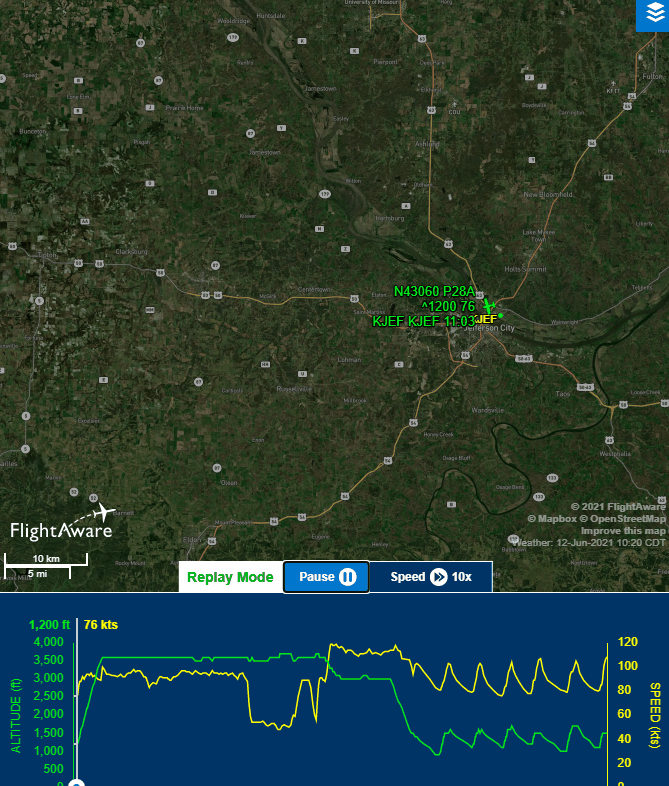

# Information
- Date: 2021-06-12
- Time: 09:00
- Expense: .00
	- Ground Instruction: .00
		- Rate: .00
		- Time: 0.0
	- Flight Instruction: 
		- Rate: $56.00
		- Time: 0.0
	- Plane Rental: $248.00
		- Rate: $138.00
		- Time: 1.8
	- Tax: .00
- Aircraft:
	- Category: Airplane
	- Classification: Single Engine Land
	- Make: Piper
	- Model: Cherokee Warrior II
	- Serial: 28-8316074
	- Identification: N43060
	- Hobbs: 
		- Start: 2173.40
		- Stop: 2175.20
	- Tach: 
		- Start: 5017.50
		- Stop: 5019.10
- Points of Departure and Arrival:
	- From: KJEF
	- To: KJEF
- Weather:
	- [Official](http://aviationwxchartsarchive.com/product/metar):
		- METAR: 
			```
			KJEF 121353Z 31008KT 10SM FEW110 28/20 A2992 RMK AO2 SLP116 T02780200
			KJEF 121453Z 34007KT 10SM CLR 29/20 A2992 RMK AO2 SLP115 T02890200 50007
			KJEF 121553Z 33009KT 10SM CLR 31/19 A2993 RMK AO2 SLP119 T03060194
			```
	- [Observed](https://www.wunderground.com/history/daily/us/mo/columbia/KJEF/):
		- Wind: 7kt from 340
		- Clouds: Clear
		- Precipitation: 0.0
		- Temperature: 82
		- Humidity: 62
		- Dew Point: 68
		- Pressure: 29.92
		- Visibility: 10sm
- Covered:
	- Slow Flight
	- Normal Landings
# Lesson Review
## Preflight
Everything checked out on the airplane this morning, other than the left wing tank being slightly below tabs - which the crack lineman made quick work of.

I made my radio call to ground, requesting taxi - to which they responded with instructions to taxi to Runway 12, via A1 to A, crossing Runway 27.  I read the instructions back to them, and we headed toward the run-up area.

I'm getting quicker and quicker at getting through the run-up checklist. This run-up was just about the same as the previous ones - so we headed to the Runway Hold Short and made our radio call for clearance.

> JEF Tower, Warrior 43060 holding short of one two on alpha, ready for departure

My CFI told me not to provide directionality to Tower so I could hear the way they responded - which was simply asking me to provide directionality

> Departing to the Southwest, 43060
## Takeoff
Takeoffs are pretty simple for me now and that makes me feel good.  I know that it's one of the simplest elements of a flight, so it's nothing impressive - but I like having it figured out.

Anyway - we rolled out toward the southwest, climbed to <del> about </del> 3500', leveled off, then performed clearing turns to set up for maneuvers.
## Manuevers
### Slow Flight
I aligned to a cardinal (North this time), reduced the power, waited for V<sub>FE/sub>, extended the flaps, waited for 60kts, then set the power to 2000 RPM. Once I had settled on my attitude, I applied the appropriate trim to keep the plane there.  After a bit, we executed a turn to the East and to the West, applying less-than-standard-rate input for a standard-rate turn.
### Stalls
Next were the stalls.  I struggle to remember the setup steps, so we have to talk through them each time we go out (I'll work on this).
#### Power Off Stall
After a quick discussion, we pitched the nose down to simulate a landing and perform a power off stall.<br />
After arriving at 65kts, I reduced the power to idle and pitched the nose up to an exaggerated flare attitude, fighting harder as the airplane slowed. Once the stall horn voiced it's objection, I pushed the nose over and increased the throttle to full, reducing flaps as I regained airspeed. nd returned to cruise flight.
#### Power On Stall
We ran through the steps to set up for a power on stall, then away we went.<br />
I reduced power to around 1300 RPM and pitched for 55kts.  Once I was there, I set the power to full and pitched the nose up into a climb attitude and held it until the stall horn chimed in - at which point I simply pushed the nose over to get back to level flight, reducing the power when we achieved cruise speed.
### Steep Turn
Out next trick was a steep turn back toward the airport and to avoid some other traffic in the area.<br />
Not much to report on this one - a dash of power, a 45 degree bank and a nice rollout to our desired heading.
## Landing
We came back the airport and shot a few landings.<br />
I'm going to be honest - these felt a bit sloppy to me. There was one point where my CFI offered to set the last notch of flaps for me on final, mentioning that I could use both hands on the yoke if necessary.
> Note: I'm not naive - I know what that means: I was performing poorly - which was *not* what I wanted to be happening at this point in my training, but I took the hint and begrudgingly forfeited control of the flaps as I approached the runway.
Other than required a bit of extra instruction on securing the correct glide slope, I was actually decently pleased with the other aspects of this portion of the day. I was remembering all of the steps and timing - and even if my execution wasn't perfect, I was happy that I was retaining something.
# Last Thoughts
If you scroll up a bit, you'll probably notice that I made a point to strike the word "about" in one of the previous sentenced - and there is a good reason.  I want to warn you that this is going to sound very braggy - but **I'm proud of it, so I'm going to tell you anyway**:<br />
My CFI said that my airwork was was really good - specifically mentioning I held my altitude and heading *very* well - even during the manuevers - he event want as far as saying that it was close to flawless as I could ask for! To me, it didn't feel flawless, so I was ecstatic to hear that.

Regarding the landings:<br />
My CFI noted that my first few patterns were good, but my performance degraded as we went along - so he attributed it to fatigue.  While he might be right - I'm still a bit frustrated with myself.  Upon reflection, I remind myself that it will take time. As a teacher of mine used to say, "It's a journey, not a light switch."
# Recap Data
- [FlightAware Tracking](https://flightaware.com/live/flight/N43060/history/20210612/1438Z/KJEF/KJEF)
- [FlightAware Tracking Log](./supportData/2021-06-12.flightAwareData.log)
- [FlightAware Tracking KML](./supportData/2021-06-12.flightAware.kml)
- [ForeFlight Log Entry](https://plan.foreflight.com/summary/2861b456a465418989bea75b8beb7e66)
- [ForeFLight Track Log](https://plan.foreflight.com/s/track/AD316531-E19D-4213-8556-97DA0643A7C2)
- [ForeFlight Track Log CSV](./supportData/2021-06-12.foreflight.tracklog.csv)
- [ForeFlight Track Log KML](./supportData/2021-06-12.foreflight.tracklog.kml)
- [ForeFlight Track Log GPX](./supportData/2021-06-12.foreflight.tracklog.gpx)

