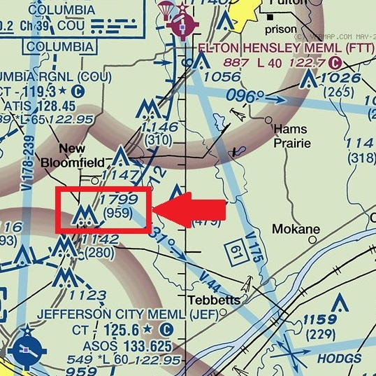

# Information
- Date: 2021-06-23
- Time: 08:00
- Expense: $295.85
	- Ground Instruction: $28.00
		- Rate: $56.00
		- Time: 0.5
	- Flight Instruction: $72.80
		- Rate: $56.00
		- Time: 1.3
	- Plane Rental: $179.40
		- Rate: $138.00
		- Time: 1.3
	- Tax: $15.65
- Aircraft:
	- Category: Airplane
	- Classification: Single Engine Land
	- Make: Piper
	- Model: Cherokee Warrior II
	- Serial: 28-8016338
	- Identification: N8222F
	- Hobbs: 
		- Start: 6034.00
		- Stop: 6035.30
	- Tach: 
		- Start: 2198.90
		- Stop: 2200.00
- Points of Departure and Arrival:
	- From: KJEF
	- To: KJEF
- Weather:
	- [Official](http://aviationwxchartsarchive.com/product/metar):
		- METAR: 
			```
			KJEF 231253Z 18008G15KT 10SM CLR 21/11 A3004 RMK AO2 SLP158 T02060106
			KJEF 231353Z 21012G16KT 10SM CLR 22/11 A3005 RMK AO2 SLP161 T02220111
			KJEF 231453Z 20013G20KT 10SM CLR 24/11 A3004 RMK AO2 SLP159 T02390111 50006
			```
	- [Observed](https://www.wunderground.com/history/daily/us/mo/columbia/KJEF/):
		- Wind: 12kts gusting to 16kts from 210
		- Clouds: Clear
		- Precipitation: 0.0
		- Temperature: 69
		- Humidity: 53
		- Dew Point: 51
		- Pressure: 30.05
		- Visibility: 10sm
- Covered:
	- Normal & Crosswind Landings
# Lesson Review
**Today was a little special!**<br />
The primary runway at KJEF was closed for maintenance, so my CFI thought it was a good opportunity to go visit a nearby airport - KFTT.
## Preflight
Nothing much to report here - everything was attached, filled and functional!
## Takeoff
We took off from runway 9 today, which was a little different sight picture then I am used to.
## Manuevers
We didn't do any manuevers today, because we were headed to spend some time in the traffic pattern at KFTT.<br />
En route, my CFI demonstrated how well some towers hid in the background. Right next to the highway we were following, there were two 1800' towers that were almost invisible until we got pretty close to them (the on-board GPS had them marked and my CFI knew exactly where they were, so there was no real danger).

## Landing
We performed 10 touch-and-Gos at KFTT.<br />
With each approach, I was lining up my approaches better and timing the various elements better.  I was still struggling with the transition from decent to the round-out (flaring a bit too early), but there was marked improvement - even with a bit of a crosswind!<br />
I got a little wobbly at the very end of one approach and executed a go-around.
# Last Thoughts
So far, today has been my favorite. It was neat to break away from KJEF and see another airport - an un-towered one at that.<br />
My CFI ran the radio today, since I hadn't been exposed to the type of communication that is required at a non-Towered, but I'll insist on doing that the next time we're there.
# Recap Data
- FlightAware Tracking - Unavailable
- FlightAware Tracking Log - Unavailable
- FlightAware Tracking KML - Unavailable
- [ForeFlight Log Entry](https://plan.foreflight.com/summary/3a83651acb0d458dbcdd364808939709)
- [ForeFlight Track Log](https://plan.foreflight.com/s/track/DC062112-86F6-46E4-BF4A-290A3DBCCA16)
- [ForeFlight Track Log CSV](./supportData/2021-06-23.foreflight.tracklog.csv)
- [ForeFlight Track Log KML](./supportData/2021-06-23.foreflight.tracklog.kml)
- [ForeFlight Track Log GPX](./supportData/2021-06-23.foreflight.tracklog.gpx)
- [CloudAhoy Debrief](https://www.cloudahoy.com/debrief/?key=BoGze62DvEbFLeE)