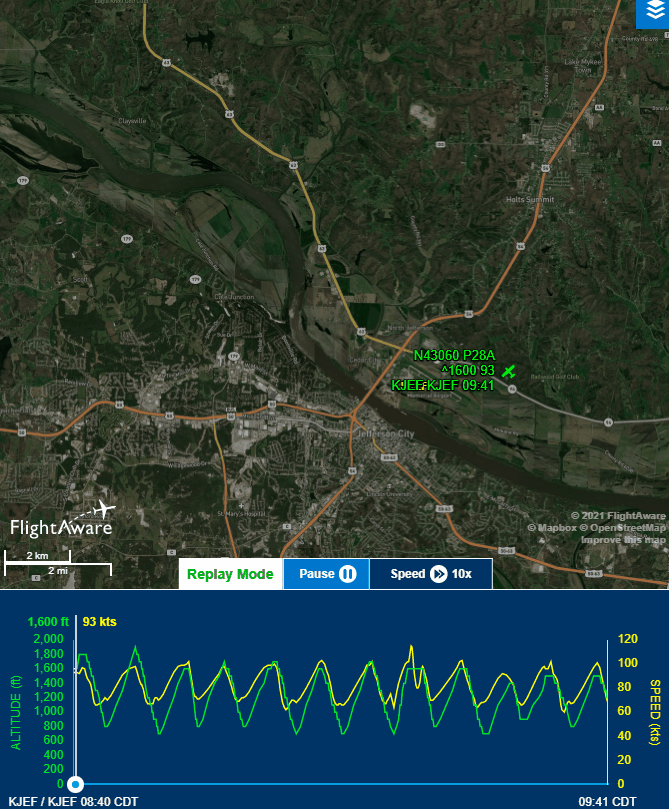

# Information
- Date: 2021-06-24
- Time: 08:00
- Expense: $350.06
	- Ground Instruction: $61.60
		- Rate: $56.00
		- Time: 1.1
	- Flight Instruction: $78.40
		- Rate: $56.00
		- Time: 1.4
	- Plane Rental: $193.20
		- Rate: $138.00
		- Time: 1.4
	- Tax: $16.86
- Aircraft:
	- Category: Airplane
	- Classification: Single Engine Land
	- Make: Piper
	- Model: Cherokee Warrior II
	- Serial: 28-8316074
	- Identification: N43060
	- Hobbs: 
		- Start: 2211.30
		- Stop: 2212.70
	- Tach: 
		- Start: 5047.00
		- Stop: 5050.00
- Points of Departure and Arrival:
	- From: KJEF
	- To: KJEF
- Weather:
	- [Official](http://aviationwxchartsarchive.com/product/metar):
		- METAR: 
			```
			KJEF 241353Z 15004KT 10SM BKN050 24/17 A3000 RMK AO2 SLP144 T02440172
			KJEF 241453Z 13005KT 10SM CLR 24/18 A2998 RMK AO2 LTG DSNT NW SLP137 T02440178 50003
			KJEF 241553Z 00000KT 10SM -RA FEW044 BKN055 BKN070 24/19 A3003 RMK AO2 LTG DSNT W-NE RAB52 SLP153 P0000 T02440189
			```
	- [Observed](https://www.wunderground.com/history/daily/us/mo/columbia/KJEF/):
		- Wind: 5kts from 130
		- Clouds: Overcast
		- Precipitation: 0.0
		- Temperature: 76
		- Humidity: 62
		- Dew Point: 62
		- Pressure: 29.98
		- Visibility: 10sm
- Covered:
	- Normal Landings, Go-Around, Short Approach
# Lesson Review
**Today was another good day.**<br />
Two good days in a row seems like a bit much to ask for - but I'll take it!
## Preflight
No issues to speak of here - everything was working as expected.
## Takeoff
No issues on takeoff - simple, simple!
## Manuevers
We were going to be spending time in the traffic pattern today, so no specific manuevers were planned...but we did get to have a little fun.  I'll get to that in the next section.
## Landing
We performed 9 Touch-ad-Gos today, for a total of 10 takeoffs and landings.<br />
According to my CFI, my approaches were spot on and a few of my landings were really good!  This is exactly what I I've been wanting to hear (it would have been nice to have heard it a few lessons ago, but I'm still pleased).<br />
One of the best parts of today was when my CFI had a conversation with the Tower over the radio.  I might not be getting it 100% right, but it was something like this:

> "JEF Tower, do you have time for a request?"
> "Yes, go ahead."
> "Are you familiar with a Pattern Cocktail?"
> "I am."
> "I'll have one of those, please."

KJEF is a small airport, so everyone knows everyone and everyone seems to get along - to the point that occasionally there will be some teasing over the radio on occasion. I was focused on flying the airplane, so I didn't  I just kind of assumed that my CFI was joking about how he might need a drink after our flight...as it turns out, this actually means "throw something unexpected at my student to see if has a heart attack".

Just as I was established on my next downwind, I heard the following call:
> "3060, immediate right 360"

It took me a second to process, but I acknowledged the call, tried really hard to remember which was was right, then banked into a right 360.  I looked at my CFI for a bit of guidance. He praised me for my prompt response, then told me that this manuever might be used by Tower to create separation.  Once I was back in line, he told me to let Tower know.

> "JEF Tower, Reestablished, 3060"

On the next round, I was given the instruction for an immediate short final.<br />
My CFI reached over and set the power to idle, informing me that I had lost my engine.  He instructed me to take a *very* early turn toward the runway and start lining up for my "emergency landing".  I bounced on this landing, but I was able to recover it by increasing power slightly to settle back down to the runway.
# Last Thoughts
I think I'm pretty close to getting landings sorted.  I know I'll never be perfect, but I'm going to keep trying to get close!<br />
My CFI ran though a pre-solo checklist, so I think I'm getting pretty close to that as well - which is pretty exciting!
# Recap Data
- [FlightAware Tracking](https://flightaware.com/live/flight/N43060/history/20210624/1340Z/KJEF/KJEF)
- [FlightAware Tracking Log](./supportData/2021-06-24.flightAwareData.log)
- [FlightAware Tracking KML](./supportData/2021-06-24.flightAware.kml)
- [ForeFlight Log Entry](https://plan.foreflight.com/summary/d94411ea7b2245bf8a401f96adaf0e2f)
- [ForeFlight Track Log](https://plan.foreflight.com/s/track/7AFBF936-4908-46FB-BE23-0FFE8B42FC9B)
- [ForeFlight Track Log CSV](./supportData/2021-06-24.foreflight.tracklog.csv)
- [ForeFlight Track Log KML](./supportData/2021-06-24.foreflight.tracklog.kml)
- [ForeFlight Track Log GPX](./supportData/2021-06-24.foreflight.tracklog.gpx)
- [CloudAhoy Debrief](https://www.cloudahoy.com/debrief/?key=70XPIRqyQ6mXfcQ)

