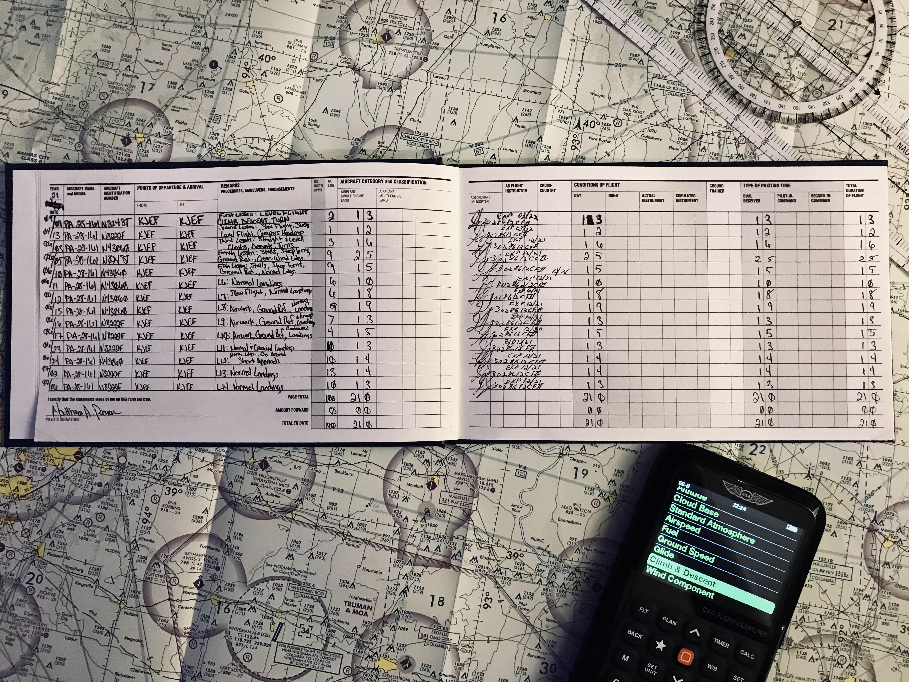

# Information
- Date: 2021-07-06
- Time: 08:00
- Expense: $307.59
	- Ground Instruction: $39.20
		- Rate: $56.00
		- Time: 0.7
	- Flight Instruction: $72.80
		- Rate: $56.00
		- Time: 1.3
	- Plane Rental: $179.40
		- Rate: $138.00
		- Time: 1.3
	- Tax: $16.19
- Aircraft:
	- Category: Airplane
	- Classification: Single Engine Land
	- Make: Piper
	- Model: Cherokee Warrior II
	- Serial: 28-8016338
	- Identification: N8222F
	- Hobbs: 
		- Start: 6065.60
		- Stop: 6066.90
	- Tach: 
		- Start: 2225.50
		- Stop: 2226.50
- Points of Departure and Arrival:
	- From: KJEF
	- To: KJEF
- Weather:
	- [Official](http://aviationwxchartsarchive.com/product/metar):
		- METAR: 
			```
			KJEF 061253Z 12004KT 8SM CLR 23/19 A3008 RMK AO2 SLP173 T02330194
			KJEF 061353Z 12005KT 9SM CLR 25/20 A3009 RMK AO2 SLP174 T02500200
			```
- Covered:
	- Normal Landings
# Lesson Review
Today was spent drawing boxes in the sky around the runway - so I'm going to skip along to the interesting bit: **where I messed it all up.**
## Landing
We shot 10 landings today...and one other thing.<br />
Around and around we went - taking off, climbing, turning, climbing, turning, leveling off, descending, turning, descending, turning, descending, landing...then doing it all over again.  Seems like I should have it all down pat, right?  Well...for about 99% of my landings, that's 110% true - but that last 1% is what bit me today.<br />
I haven't had much of an excuse to execute Go-Arounds - which is good and bad.  On the good side, I'm not messing up my approaches enough to need them. On the bad side, I don't get much practice with them - so my CFI decided to throw one at me for practice.<br />
The execution is simple enough: full throttle, pitch the nose slightly down and retract the flaps one notch at a time while airspeed builds.<br />
Well, today my brain was a bit impatient - because for whatever reason I retracted the flaps to 0° in one swing.

> Hint: That is ***<u>not</u>*** ideal.

We had gained enough altitude at that point that it didn't actually cause an issue - but it could have. I really have no idea what I was thinking - maybe I was still in Touch-and-Go mode where you *do* retract the flaps to 0°? There really isn't a good excuse.

My CFI said that I hadn't made him nervous before today - but that little stunt had done the trick (understandably).  So, that's one for the books.  Hopefully it never happens again.
# Last Thoughts
So, aside from a poorly executed Go-Around, everything went really well.  My CFI said my pattern work has been excellent for the last few lessons, and he has been hinting pretty hard at me getting ready for a solo (even after I tried to kill him today) - so that makes me feel good.

One quick thing that I wanted to mention was that I hit a bit of a personal milestone: I filled the first page of my log book!

> Alright, before you say anything:<br />
Yes, I know that isn't a *real* accomplishment and no, I don't care what you think - I think it is cool. :)<br />
# Recap Data
- FlightAware Tracking - Unavailable
- FlightAware Tracking Log - Unavailable
- FlightAware Tracking KML - Unavailable
- [ForeFlight Log Entry](https://plan.foreflight.com/summary/9dac9503a8a241b1a5ca4b4ef3248775)
- [ForeFlight Track Log](https://plan.foreflight.com/s/track/9FB5F564-9CF4-4EF8-9691-462550337EBE)
- [ForeFlight Track Log CSV](./supportData/2021-07-06.foreflight.tracklog.csv)
- [ForeFlight Track Log KML](./supportData/2021-07-06.foreflight.tracklog.kml)
- [ForeFlight Track Log GPX](./supportData/2021-07-06.foreflight.tracklog.gpx)
- [CloudAhoy Debrief](https://www.cloudahoy.com/debrief/?key=foaSc3pGW0urYZtSU)