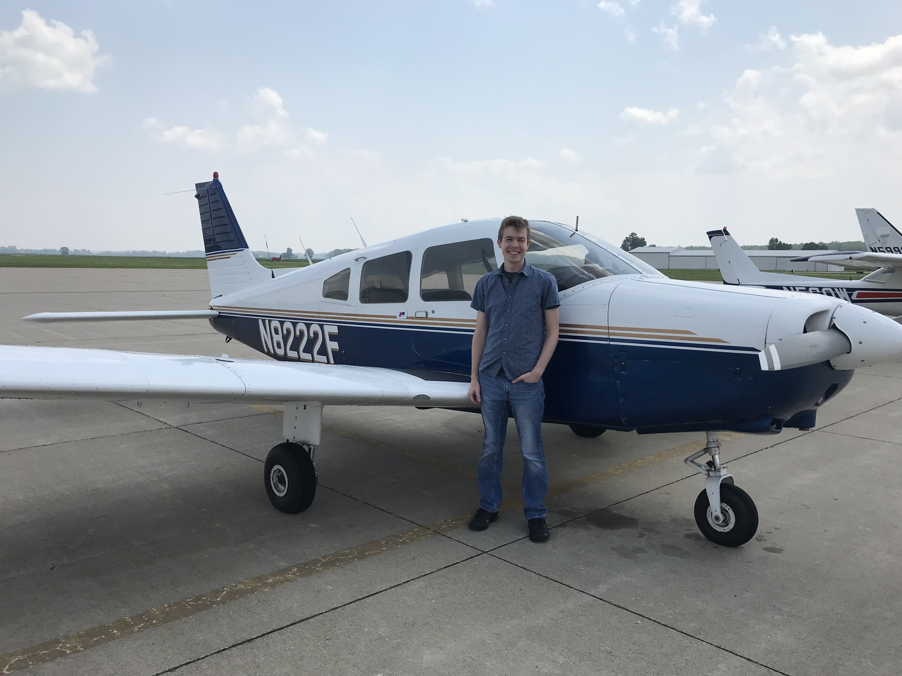

# Information
- Date: 2021-08-02
- Time: 08:00
- Expense: $457.09
	- Ground Instruction: $28.00
		- Rate: $56.00
		- Time: 0.5
	- Flight Instruction: $84.00
		- Rate: $56.00
		- Time: 1.5
	- Plane Rental: $317.40
		- Rate: $138.00
		- Time: 2.3
	- Tax: $27.69
- Aircraft:
	- Category: Airplane
	- Classification: Single Engine Land
	- Make: Piper
	- Model: Cherokee Warrior II (PA-28-161)
	- Serial: 28-8016338
	- Identification: N8222F
	- Hobbs: 
		- Start: 6130.2
		- Stop: 6132.5
	- Tach: 
		- Start: 2278.9
		- Stop: 2280.7
- Points of Departure and Arrival:
	- From: KJEF
	- To: KJEF
- Weather:
	- [Official](http://aviationwxchartsarchive.com/product/metar):
		- METAR: 
			```
			KJEF 021253Z 00000KT 4SM HZ CLR 21/17 A3015 RMK AO2 SLP196 T02110172
			KJEF 021353Z 00000KT 5SM HZ CLR 22/17 A3015 RMK AO2 SLP198 T02220172
			KJEF 021453Z 16003KT 6SM HZ CLR 25/17 A3015 RMK AO2 SLP194 T02500172 50002
			```
- Covered:
	- Normal Landings / 1<sup>st</sup> Solo
# Lesson Review
**FIRST SOLO!**<br />
FINALLY!  It has been a long time coming, and the day is finally here!  I'll get right into it.
## Landing
After my CFI looped around the traffic pattern about 13 times (pretty uneventful), he asked if I was ready to go solo...and of course I said yes!

After a quick stop to empty the left seat, I called for clearance and headed back toward the taxiway. My CFI was standing by with his radio in hand, just in case I needed some guidance. Thankfully, there were only two times he needed to chime in for: 1) to warn the the controllers that this was a Student Solo and 2) to compliment a couple of my landings!

I shot 5 landings by myself, 3 full-stop taxi back landings and 1 Touch-and-Go before going full-stop to the ramp.
# Last Thoughts
If we really look at things, save for a slight weight reduction, there isn't any real difference between your first solo pattern and the dual pattern right before it. On paper, that's absolutely accurate - and until today, my analytical brain would have supported that statement. Post-solo, I'm going to tell you that whatever is written on the afore mentioned paper is utter nonsense.

Honestly, I wasn't all that nervous about my solo. I usually am anxious about things in general...but this wasn't one of them for some reason. Right about the time I lined up for final on my first circuit there was a moment where that changed a bit.<br />
I realized that the safety net that I had grown accustomed to wasn't in the seat next to me. As good as my CFI is at his job, there was absolutely nothing he could do if I messed this up...*I was alone.*

I think the firm clicking noise that the flap lever makes must have kicked those doubts from my mind, because I set my last notch of flaps and landed the plane - **all by myself**.

**Man, that was stinking awesome!** I went around a few more times, with the smile on my face growing wider with each circuit. One of my favorites was when my CFI complimented a couple of my landings over the Tower frequency. It's one thing to have your CFI compliment you in the cockpit - but it's different when it happens on a public frequency were *everyone* can hear it.

> **I have a video to show you.**<br />
> <del>Once I get it edited, I'll toss a link on here.</del>Unfortunately, the audio port I had the GoPro plugged into wasn't turned up (not pleased about that one), so I don't have any proof that my CFI was nice to me. You'll just have to take my word for it.

[Here](https://youtu.be/5AMr2JNpM9o) is a link to the video!

After I got back to the ramp and shut things down, my CFI walked out to the plane, shook my hand, congratulated me, took a photo and then we headed to the newly built on-airport restaurant to celebrate with a bit of lunch.

# Recap Data
- [ForeFlight Log Entry](https://plan.foreflight.com/logbook#/entries?entryId=5d448fe27bd14e7dbf3e5909c1d574d8)
- [ForeFlight Track Log](https://plan.foreflight.com/tracklogs#/7D44E786-0616-422E-A871-171F03054B85)
- [ForeFlight Track Log CSV](./supportData/2021-08-02.foreflight.tracklog.csv)
- [ForeFlight Track Log KML](./supportData/2021-08-02.foreflight.tracklog.kml)
- [ForeFlight Track Log GPX](./supportData/2021-08-02.foreflight.tracklog.gpx)