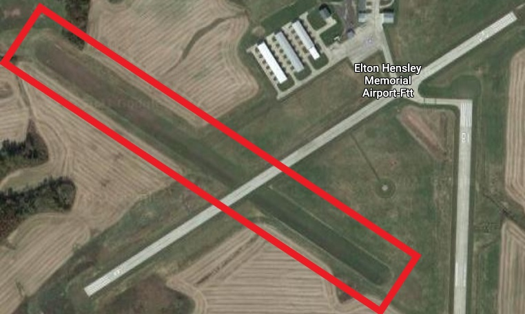

# Information
- Date: 2021-08-04
- Time: 10:30
- Expense: $265.94
	- Ground Instruction: $0.00
		- Rate: $56.00
		- Time: 0.0
	- Flight Instruction: $0.00
		- Rate: $56.00
		- Time: 0.0
	- Plane Rental: $248.40
		- Rate: $138.00
		- Time: 1.8
	- Tax: $17.54
- Aircraft:
	- Category: Airplane
	- Classification: Single Engine Land
	- Make: Piper
	- Model: Cherokee Warrior II (PA-28-161)
	- Identification: N8222F
	- Hobbs: 
		- Start: 6137.80
		- Stop: 6139.60
	- Tach: 
		- Start: 2284.80
		- Stop: 2286.40
- Points of Departure, En Route and Arrival:
	- From: KJEF
	- Via: KFTT, H79, KFTT
	- To: KJEF
- Weather:
	- [Official](http://aviationwxchartsarchive.com/product/metar):
		- METAR: 
			```
			KJEF 041453Z 13003KT 10SM CLR 23/16 A3016 RMK AO2 SLP199 T02280156 51005
			KJEF 041553Z 11005KT 10SM CLR 25/15 A3016 RMK AO2 SLP200 T02500150
			KJEF 041653Z 11005KT 10SM CLR 26/13 A3016 RMK AO2 SLP199 T02610128
			```
- Covered:
	- Pattern Entry/Exit Procedures
# Lesson Review
Today my CFI and headed out to work on my pattern entry and exit procedures.

First, we departed KJEF to the northeast to practice in the pattern at KFTT (Fulton).<br />
On the way up, we tuned into the CTAF frequency and started listening to traffic around the airport.
- Once we got within 10 miles, we made our first call:
	> Fulton Traffic, Warrior 8222 Foxtrot, 10 miles southwest at 3000, inbound for landing, Fulton
- At 6 miles, we began our decent to pattern altitude
- At around 5 miles, we made the next call:
	> Fulton Traffic, Warrior 8222 Foxtrot, 5 miles southwest, at 2500 descending, inbound for Touch-and-Go, Fulton
- At 3 miles, we made a call announcing our precise intentions:
	> Fulton Traffic, Warrior 8222 Foxtrot, approaching for 45 right downwind
- Once we hit the pattern, these were the calls:
	- > Fulton Traffic, 22 Foxtrot, entering 45 downwind
	- > Fulton Traffic, 22 Foxtrot, turning base, Fulton
	- > Fulton Traffic, 22 Foxtrot, turning final, Fulton
	- > Fulton Traffic, 22 Foxtrot, crosswind departure, Fulton

Next, we headed southwest to H79 (Eldon).<br />
The procedure was mostly the same, but en route, we notified JKEF that we would be transitioning their Class D on our way to H79.

After performing a Touch-and-Go, we headed back toward KFTT so my CFI could demonstrate a soft-field take off and landing on th the grass strip.<br />
The grass was definitely and interesting experience! Very bumpy and an add runway layout, as it crossed the hard-surface runway.


After my CFI was done walking me through the procedure, we called it a day and headed back toward KJEF.
# Last Thoughts
**My radio calls at un-towered airports needs a bit of work.**<br />
I have the radio procedure figured out around my home airport, but I stumble a bit with the unstructured communications.  It might be the fact that I'm not actually talking to anyone - just more announcing to the whole wide world that I'm buzzing about and not trying to crash - or maybe it's not that at all.  Either way, I need to do it some more so I feel good about it.

I'll probably try to get my CFI to endorse me to land at another airport so I can spend some time in that airspace annoying the people unlucky enough to be on CTAF.
# Recap Data
- [ForeFlight Log Entry](https://plan.foreflight.com/summary/6c294ef8d3274e94ac8428621de4b9db)
- [ForeFlight Track Log](https://plan.foreflight.com/s/track/8713E943-8710-43E0-90A9-5C2EFE179C39)
- [ForeFlight Track Log CSV](./supportData/2021-08-04.foreflight.tracklog.csv)
- [ForeFlight Track Log KML](./supportData/2021-08-04.foreflight.tracklog.kml)
- [ForeFlight Track Log GPX](./supportData/2021-08-04.foreflight.tracklog.gpx)