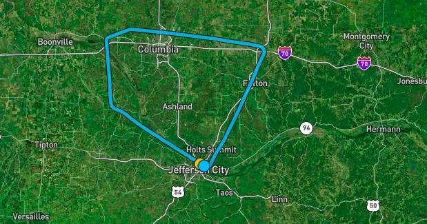

# Information
- Date: 2021-08-05
- Time: 08:00
- Expense: $368.99
	- Ground Instruction: $28.00
		- Rate: $56.00
		- Time: 0.5
	- Flight Instruction: $72.80
		- Rate: $56.00
		- Time: 1.3
	- Plane Rental: $248.40
		- Rate: $138.00
		- Time: 1.8
	- Tax: $19.79
- Aircraft:
	- Category: Airplane
	- Classification: Single Engine Land
	- Make: Piper
	- Model: Cherokee Warrior II (PA-28-161)
	- Identification: N43060
	- Hobbs: 
		- Start: 2362.60
		- Stop: 2363.90
	- Tach: 
		- Start: 5175.10
		- Stop: 5176.30
- Points of Departure, En Route and Arrival:
	- From: KJEF
	- Via: N/A
	- To: KJEF
- Weather:
	- [Official](http://aviationwxchartsarchive.com/product/metar):
		- METAR: 
			```
			KJEF 051253Z 11005KT 10SM BKN060 19/14 A3012 RMK AO2 SLP186 T01890144
			KJEF 051353Z 12005KT 10SM SCT055 OVC100 21/15 A3013 RMK AO2 SLP188 T02060150
			KJEF 051453Z 12005KT 10SM BKN080 23/16 A3011 RMK AO2 SLP184 T02280156 50003
			```
- Covered:
	- Simulated Instrument Training, RNAV 12 Approach
# Lesson Review
**I wore funny glasses today.**<br />
Technically, they were one of two types of view limiting devices: foggles.  The whole point was to obscure my view out of the windows so I could only see the instruments.  My CFI gave me specific headings and altitudes and I simply executed them.

We left KJEF's airspace and headed northeast, turned northwest for a bit, slightly southwest, then southeast back toward KJEF.

Once we crossed our initial GPS fix (GIBSN) at 3000' MSL, we settled on a specific heading (119) toward the next waypoint (JAKBO), then began a planned descent to intercept the glide slope at our next fix (IBUYI) at 2300' MSL.  We continued on the glide slope for a bit and then my CFI had me remove the foggles.

I was lined up <u>***perfectly***</u> for a final to Runway 12.

I se the plane down (I actually bounced it a bit), and came to a full stop on the runway.  My CFI then took the controls and demonstrated a short-field takeoff, then turned the controls back over to me to bring us in for a landing (this one was much better).
# Last Thoughts
***That* was neat.**

It was weird spending the entire time focused on a heading and altitude bug, but the end result was very cool. I've compared today's track log to that of my previous flights and the difference is amazing. 

The difference between Visual Flight and Instrument Flight is precision. Although I've always wanted to get an Instrument Rating, I was never really sure why (other than confidence in weather), but now I know that I have a knack for it and enjoy the results!

Looking up at the last moment to see the runway perfectly aligned with the spinner was one of the coolest moments I've experienced so far.
# Recap Data
- [ForeFlight Log Entry](https://plan.foreflight.com/summary/11dde1f66f774ed8985e412aa28aca91)
- [ForeFlight Track Log](https://plan.foreflight.com/s/track/07179166-5EEB-44B7-BE2B-74EC75FB02DE)
- [ForeFlight Track Log CSV](./supportData/2021-08-05.foreflight.tracklog.csv)
- [ForeFlight Track Log KML](./supportData/2021-08-05.foreflight.tracklog.kml)
- [ForeFlight Track Log GPX](./supportData/2021-08-05.foreflight.tracklog.gpx)